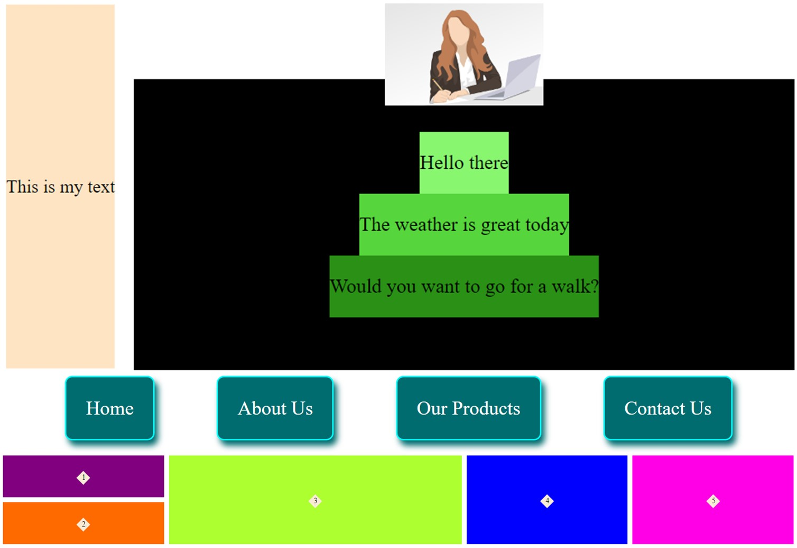

# CSS Assignment

Practicing Grid and Flex system for styling in css

## Requirements

1. Complete the styles.css files in each folder to produce the expect result
2. There is one expected.png file in each folder, which shows the expected layout. Colors and spacing can be different, but layout is supposed to be similar.
3. All the changes should be made to file .css only. Do not modify index.html

## Results

Followings are the result from all four exercises combined:

   

## Resources
- [CSS: Cascading Style Sheets](https://developer.mozilla.org/en-US/docs/Web/CSS)